# ICA (Análisis de Componentes Independientes)

## 1. Descripción teórica

### Explicación del algoritmo y objetivo principal

El Análisis de Componentes Independientes (ICA) es una técnica de separación ciega de fuentes (BSS, por sus siglas en inglés). Dado un conjunto de señales observadas que son mezclas lineales de fuentes independientes desconocidas, ICA recupera las fuentes originales sin conocer el proceso de mezcla. Formalmente, si X = A·S donde X son las observaciones, A es la matriz de mezcla desconocida y S son las fuentes independientes, ICA estima una matriz W ≈ A⁻¹ tal que S ≈ W·X. El algoritmo FastICA maximiza la no-gaussianidad de las componentes extraídas (medida por negentropía o kurtosis), basándose en el Teorema Central del Límite: las mezclas de señales independientes tienden a ser más gaussianas que las fuentes originales.

### Principales características y supuestos

- **Independencia estadística**: las fuentes originales deben ser estadísticamente independientes (más fuerte que la decorrelación).
- **No-gaussianidad**: como máximo una fuente puede ser gaussiana; las demás deben tener distribuciones no-gaussianas.
- **Mezcla lineal e instantánea**: el modelo asume que las observaciones son combinaciones lineales de las fuentes en el mismo instante temporal.
- **Ambigüedades**: ICA no puede determinar el orden, el signo ni la escala de las componentes (son indeterminaciones inherentes).
- **Blanqueo previo (whitening)**: se pre-procesa para decorrelacionar y normalizar las señales, reduciendo el problema a buscar una rotación que maximice la independencia.

### Diferencias con PCA

| Aspecto | ICA | PCA |
|---|---|---|
| Objetivo | Maximizar independencia estadística | Maximizar varianza explicada |
| Criterio | No-gaussianidad (negentropía, kurtosis) | Varianza (valores propios) |
| Tipo de relación | Capta dependencias de orden superior | Solo decorrelación (2do orden) |
| Ortogonalidad | Componentes no necesariamente ortogonales | Componentes ortogonales |
| Ordenamiento | Sin orden natural entre componentes | Ordenadas por varianza decreciente |
| Aplicación típica | Separación de fuentes (señales) | Reducción de dimensionalidad |

## 2. Usos y aplicaciones

### Principales usos en análisis de datos

- **Separación ciega de fuentes (BSS)**: extraer señales originales a partir de mezclas observadas, sin conocimiento previo del proceso de mezcla.
- **Eliminación de artefactos**: remover ruido, artefactos musculares o parpadeos de señales biomédicas.
- **Extracción de características**: obtener representaciones estadísticamente independientes que pueden ser más informativas para tareas de clasificación.

### Áreas de aplicación

1. **Electrocardiografía (ECG)**: separación de la actividad cardíaca de diferentes fuentes (actividad auricular vs ventricular), eliminación de ruido muscular y de línea eléctrica. En este ejercicio, ICA separa las componentes independientes de las derivaciones ECG, permitiendo aislar patrones como la onda P.
2. **Electroencefalografía (EEG)**: eliminación de artefactos oculares (parpadeos) y musculares de registros cerebrales. Es estándar en herramientas como EEGLAB para limpiar datos antes de análisis de potenciales evocados.
3. **Procesamiento de audio (problema del cóctel)**: separar las voces individuales de hablantes a partir de grabaciones con múltiples micrófonos, donde cada micrófono capta una mezcla de todas las fuentes.

## 3. Aplicación práctica

### Dataset utilizado

- **Fuente**: MIT-BIH Arrhythmia Database — P-Wave Annotations (PhysioNet, https://physionet.org/content/pwave/1.0.0/)
- **Descripción**: 12 registros ECG seleccionados del MIT-BIH Arrhythmia Database con anotaciones de onda P realizadas por dos expertos. Los registros incluyen patologías que dificultan la detección de ondas P.
- **Registros analizados**: ['100', '119', '207']
- **Canales por registro**: 2 (derivación MLII + derivación precordial V1/V2/V5)
- **Frecuencia de muestreo**: 360 Hz
- **Ventana analizada**: 3600 muestras (10.0 segundos)

### Decisiones de preprocesamiento

- Se seleccionó una ventana de 10 segundos desde el inicio de cada registro para el análisis.
- Se aplicó `StandardScaler` por canal (media=0, std=1) antes de ICA, ya que FastICA requiere señales centradas.
- Se utilizó blanqueo (whitening='unit-variance') como paso previo a la extracción de componentes.

### Parámetros del algoritmo

| Parámetro | Valor |
|---|---|
| Algoritmo | FastICA (scikit-learn) |
| Componentes | 2 (igual al número de canales) |
| Whitening | unit-variance |
| Iteraciones máximas | 1000 |

### Resultados obtenidos

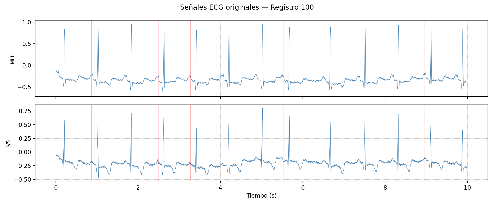

**Figura 1.** Señales ECG originales del registro 100. Cada canal (derivación) muestra una mezcla diferente de la misma actividad cardíaca. Las líneas verticales rojas indican las anotaciones de onda P.

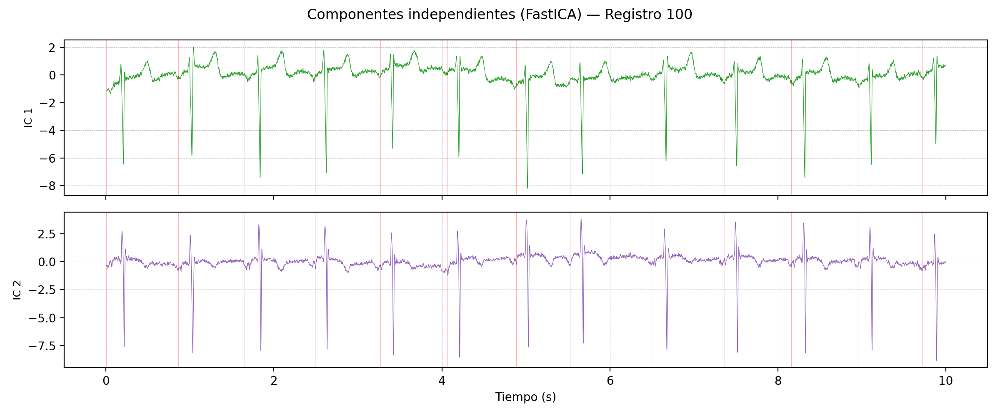

**Figura 2.** Componentes independientes extraídos por FastICA del registro 100. Cada IC representa una fuente estadísticamente independiente separada de las mezclas originales.

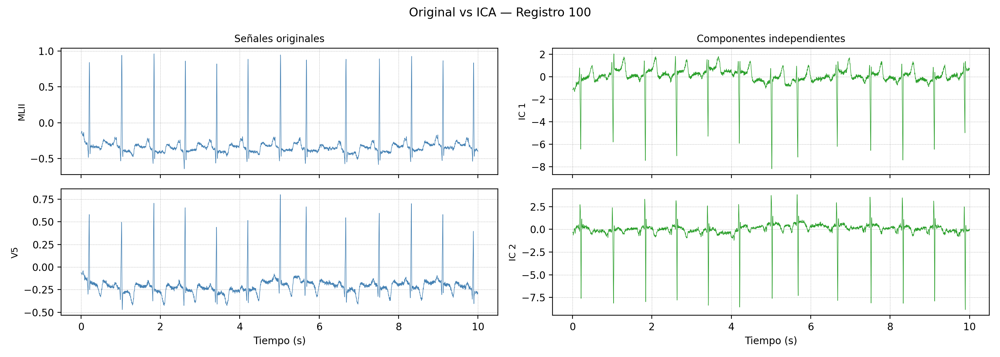

**Figura 3.** Comparación lado a lado entre señales originales (izquierda) y componentes ICA (derecha) para el registro 100.

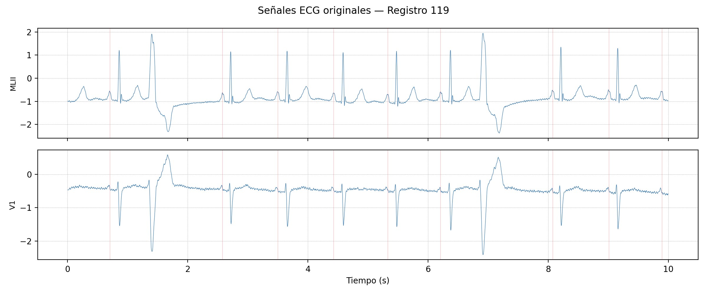

**Figura 4.** Señales ECG originales del registro 119. Cada canal (derivación) muestra una mezcla diferente de la misma actividad cardíaca. Las líneas verticales rojas indican las anotaciones de onda P.

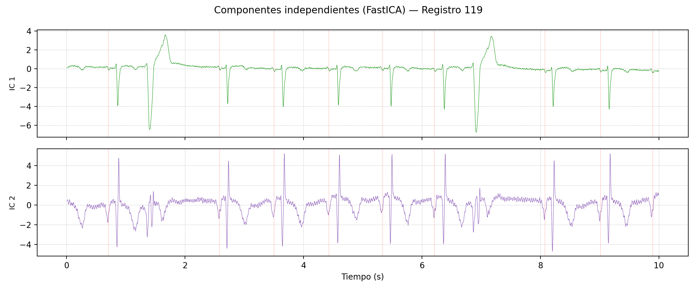

**Figura 5.** Componentes independientes extraídos por FastICA del registro 119. Cada IC representa una fuente estadísticamente independiente separada de las mezclas originales.

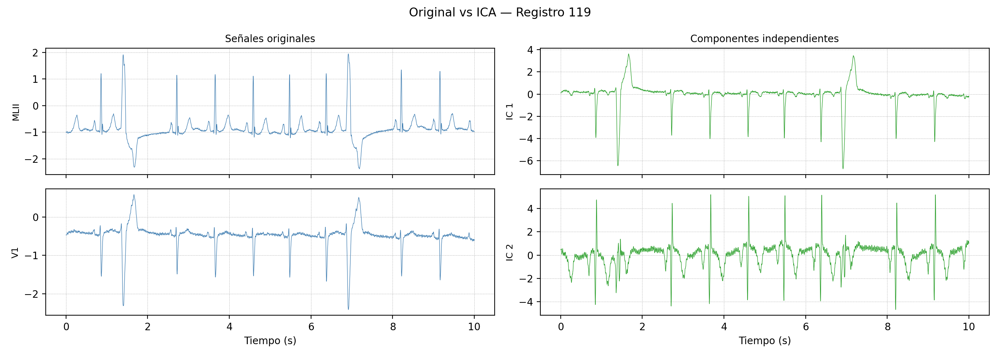

**Figura 6.** Comparación lado a lado entre señales originales (izquierda) y componentes ICA (derecha) para el registro 119.

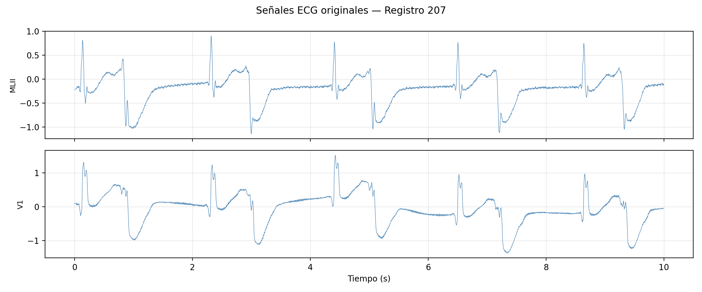

**Figura 7.** Señales ECG originales del registro 207. Cada canal (derivación) muestra una mezcla diferente de la misma actividad cardíaca. Las líneas verticales rojas indican las anotaciones de onda P.

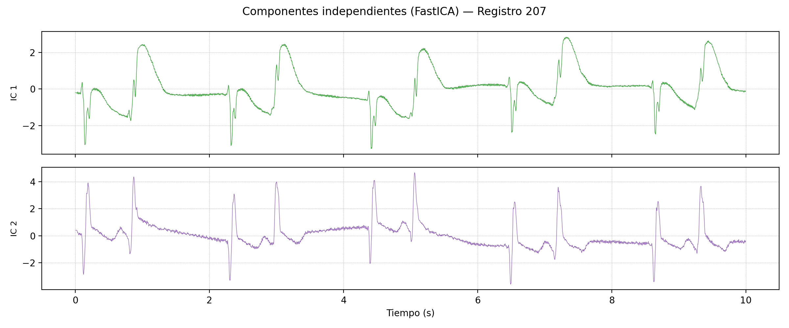

**Figura 8.** Componentes independientes extraídos por FastICA del registro 207. Cada IC representa una fuente estadísticamente independiente separada de las mezclas originales.

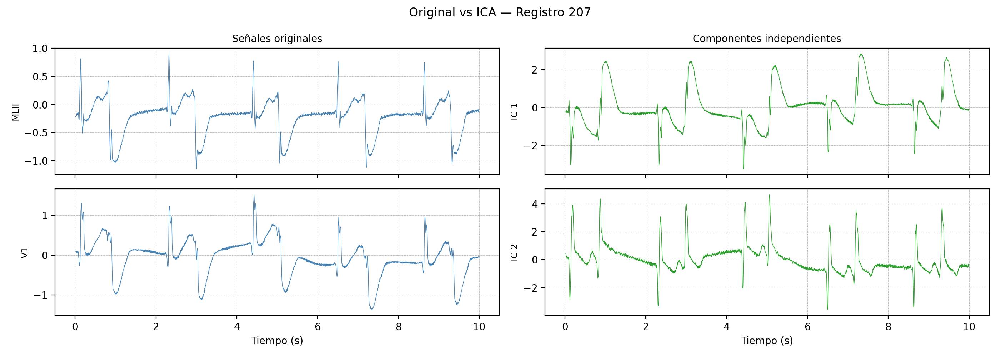

**Figura 9.** Comparación lado a lado entre señales originales (izquierda) y componentes ICA (derecha) para el registro 207.

**Tabla 1.** Kurtosis (Fisher) de los canales originales y los componentes ICA por registro. Una kurtosis mayor indica distribuciones más impulsivas (mayor no-gaussianidad).

| Registro | Canal original | Kurtosis orig. | Componente | Kurtosis IC |
|---|---|---|---|---|
| 100 | MLII | 28.51 | IC 1 | 21.27 |
| 100 | V5 | 20.77 | IC 2 | 32.12 |
| 119 | MLII | 12.06 | IC 1 | 16.18 |
| 119 | V1 | 15.39 | IC 2 | 5.22 |
| 207 | MLII | 1.32 | IC 1 | 1.05 |
| 207 | V1 | 0.91 | IC 2 | 4.46 |

Kurtosis promedio (|valor|): originales = 13.16, ICA = 13.38

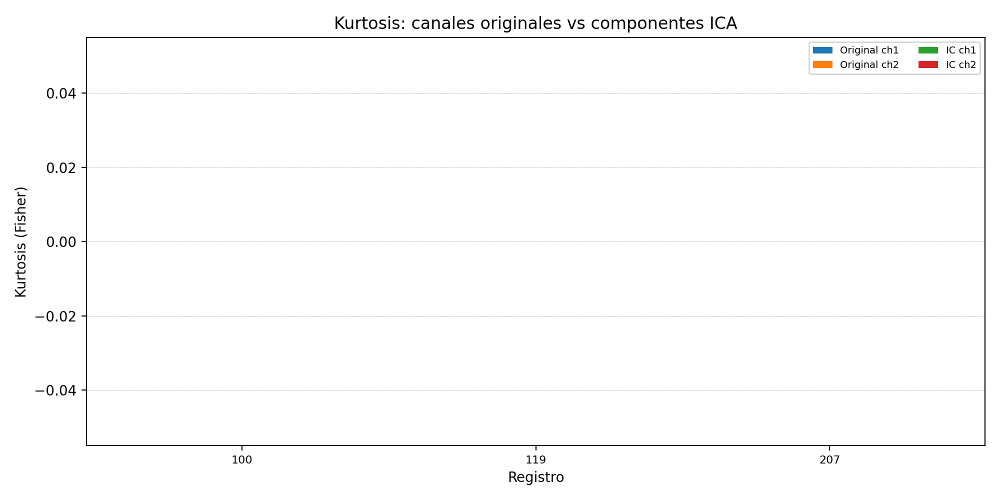

**Figura 10.** Comparación de kurtosis entre canales originales e componentes ICA para cada registro. Los componentes ICA tienden a presentar mayor no-gaussianidad, confirmando la maximización de independencia estadística.

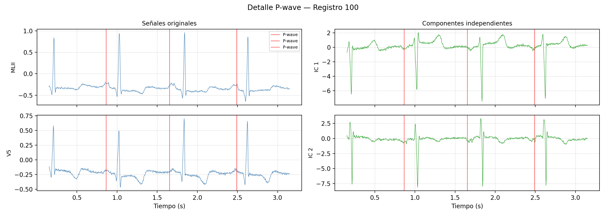

**Figura 11.** Detalle de onda P para el registro 100. Las líneas verticales rojas marcan las anotaciones de onda P realizadas por expertos. Se comparan las señales originales (izquierda) con los componentes ICA (derecha) en una ventana de ~3 segundos.

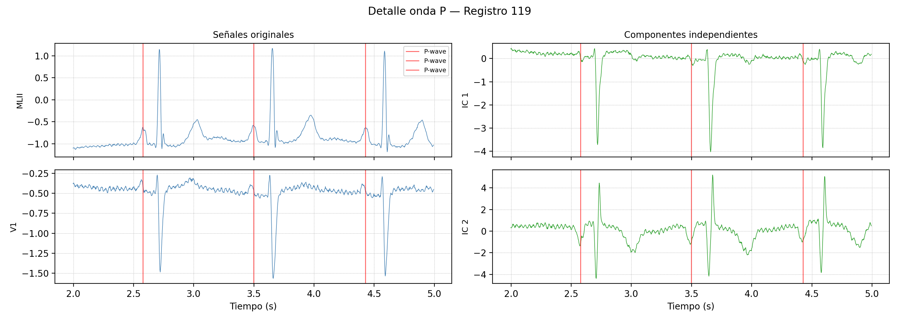

**Figura 12.** Detalle de onda P para el registro 119. Las líneas verticales rojas marcan las anotaciones de onda P realizadas por expertos. Se comparan las señales originales (izquierda) con los componentes ICA (derecha) en una ventana de ~3 segundos.

### Interpretación

FastICA descompone las dos derivaciones ECG en dos componentes estadísticamente independientes. La Tabla 1 muestra que los componentes ICA presentan una kurtosis promedio de 13.38 (vs 13.16 de los canales originales), lo que confirma que el algoritmo maximiza la no-gaussianidad de cada componente, aislando fuentes con distribuciones más impulsivas (picos QRS, ondas P).

En las figuras de comparación se observa que las componentes ICA redistribuyen la información de las derivaciones: un IC tiende a capturar la actividad ventricular dominante (complejos QRS), mientras que el otro aísla mejor las ondas P y T de menor amplitud. Las figuras de detalle de onda P muestran que las anotaciones (marcadas en rojo) coinciden con morfologías recurrentes en las componentes, validando que ICA puede facilitar la detección de estas ondas al separarlas de la actividad ventricular dominante.

### Limitaciones

- **Solo 2 canales disponibles**: con únicamente 2 derivaciones ECG, ICA solo puede separar 2 componentes independientes. Con más canales (e.g., ECG de 12 derivaciones) se podrían aislar más fuentes fisiológicas.
- **Mezcla lineal e instantánea**: ICA asume que las señales observadas son combinaciones lineales instantáneas de las fuentes. En la práctica, las señales cardíacas tienen retardos de conducción que violan parcialmente este supuesto.
- **Ambigüedad en orden y signo**: las componentes ICA no tienen un orden natural ni signo definido; la interpretación fisiológica requiere conocimiento del dominio.
- **Ventana corta**: se analizaron solo 10 segundos de cada registro; una ventana más larga podría capturar mayor variabilidad en los patrones.
- **Validación limitada**: aunque las anotaciones de onda P sirven como referencia, no se realizó una evaluación cuantitativa de la calidad de la separación (e.g., relación señal-ruido por componente).
