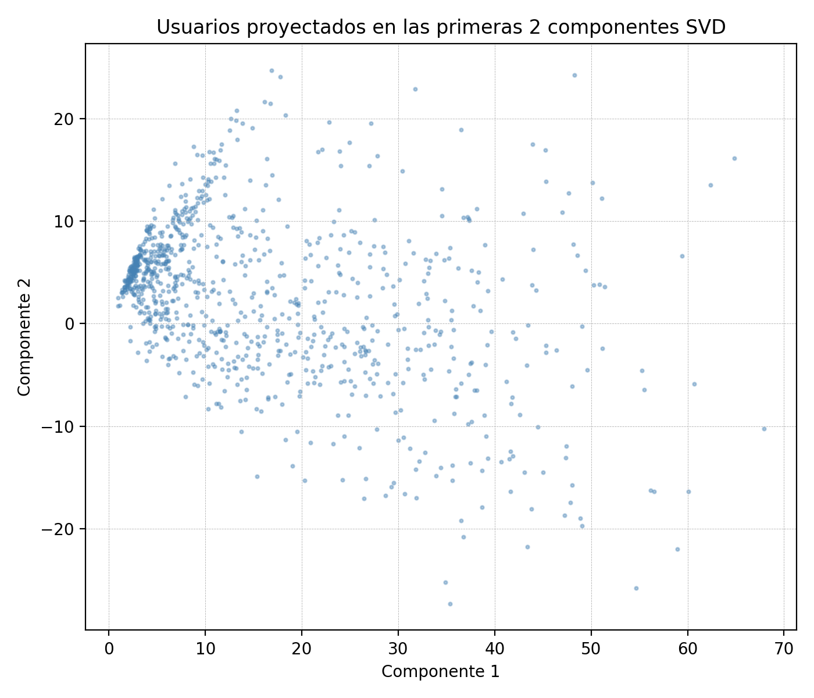
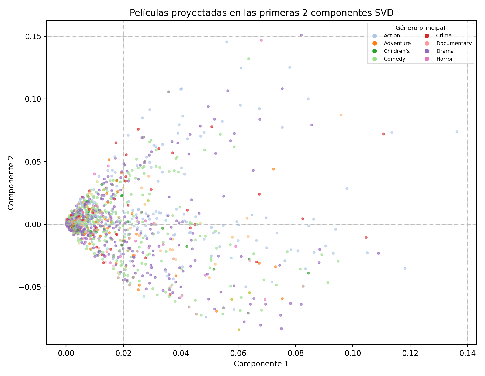
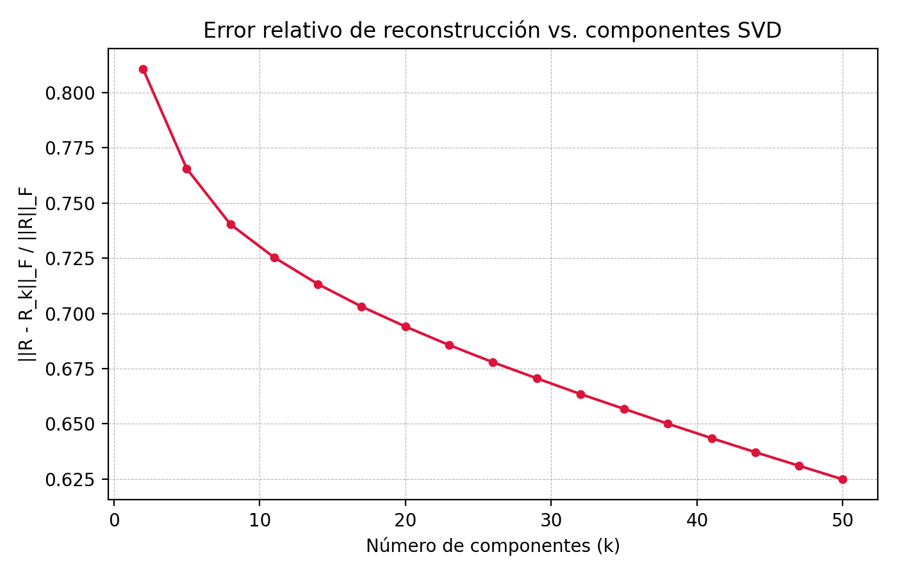

# SVD (Descomposición en Valores Singulares)

## 1. Descripción teórica

### Explicación del algoritmo y objetivo principal

La Descomposición en Valores Singulares (SVD) factoriza una matriz A de dimensiones m×n en tres matrices: A = U·Σ·Vᵀ, donde U (m×m) contiene los vectores singulares izquierdos, Σ (m×n) es una matriz diagonal con los valores singulares ordenados de mayor a menor, y Vᵀ (n×n) contiene los vectores singulares derechos. Su objetivo principal es la reducción de dimensionalidad: al retener solo los k valores singulares más grandes se obtiene la mejor aproximación de rango k en norma de Frobenius.

### Principales características y supuestos

- Es un método determinístico y algebraicamente exacto (no iterativo en su forma teórica).
- No requiere que los datos sigan una distribución particular (no asume normalidad).
- Opera directamente sobre la matriz de datos, sin necesidad de calcular la matriz de covarianza.
- La variante TruncatedSVD utilizada aquí trabaja eficientemente con matrices dispersas, ya que no centra los datos (no resta la media), a diferencia de PCA.
- Los valores singulares reflejan la importancia relativa de cada componente: σ₁ ≥ σ₂ ≥ ... ≥ σₖ.

### Diferencias con PCA

| Aspecto | SVD (TruncatedSVD) | PCA |
|---|---|---|
| Centrado | No centra los datos | Centra (resta la media) |
| Matrices dispersas | Soporte nativo (no densifica) | Requiere densificar o usar variantes |
| Base matemática | Factorización directa A = UΣVᵀ | Diagonalización de la covarianza Cov = VΛVᵀ |
| Interpretación | Factores latentes de la matriz original | Direcciones de máxima varianza centrada |
| Caso especial | PCA es SVD aplicado a datos centrados | — |

## 2. Usos y aplicaciones

### Principales usos en análisis de datos

- **Reducción de dimensionalidad**: comprimir datos de alta dimensión preservando la mayor varianza posible.
- **Sistemas de recomendación**: factorización de matrices usuario-ítem para descubrir factores latentes (gustos, categorías implícitas).
- **Compresión de datos e imágenes**: aproximaciones de bajo rango para almacenamiento eficiente.
- **Procesamiento de lenguaje natural (LSA/LSI)**: reducir la matriz término-documento para capturar relaciones semánticas.

### Áreas de aplicación

1. **Sistemas de recomendación (Netflix, Spotify)**: SVD identifica factores latentes en matrices de ratings para predecir preferencias no observadas. Es la base del filtrado colaborativo matricial.
2. **Procesamiento de imágenes y visión por computadora**: la aproximación de bajo rango permite comprimir imágenes reteniendo las estructuras visuales más relevantes, y se usa en reconocimiento facial (eigenfaces).
3. **Bioinformática**: análisis de matrices de expresión génica para identificar patrones de co-expresión entre genes y condiciones experimentales.

## 3. Aplicación práctica

### Dataset utilizado

- **Fuente**: MovieLens 100k (GroupLens Research, University of Minnesota)
- **Usuarios**: 943
- **Películas**: 1682
- **Ratings totales**: 100,000
- **Escala de ratings**: 1 a 5 (enteros)
- **Densidad de la matriz**: 6.30% (altamente dispersa)

### Decisiones de preprocesamiento

- Se construyó una matriz dispersa usuario-película en formato CSR (Compressed Sparse Row) de 943×1682.
- Se utilizaron los ratings directos como valores (sin centrar), apropiado para TruncatedSVD sobre matrices dispersas.
- Se solicitaron 50 componentes para el análisis.

### Resultados obtenidos

**Tabla 1.** Resumen de la descomposición SVD sobre MovieLens 100k.

| Métrica | Valor |
|---|---|
| Componentes utilizados | 50 |
| Varianza explicada (1er componente) | 15.39% |
| Varianza acumulada (5 componentes) | 28.59% |
| Varianza acumulada total (50 comp.) | 52.35% |
| Componentes para 80% de varianza | >50 (no alcanzado) |
| Componentes para 90% de varianza | >50 (no alcanzado) |

**Figura 1.** Varianza explicada por cada componente SVD (izquierda) y varianza acumulada (derecha). Las líneas horizontales punteadas indican los umbrales del 80% y 90%.

**Figura 2.** Proyección de los 943 usuarios en las primeras 2 componentes SVD. Cada punto representa un usuario; la concentración central refleja patrones de rating compartidos, mientras que los puntos periféricos corresponden a usuarios con preferencias atípicas.

**Figura 3.** Proyección de las 1682 películas en las primeras 2 componentes SVD, coloreadas por género principal. Los agrupamientos por color confirman que los factores latentes capturan información semántica relacionada con los géneros cinematográficos.

**Figura 4.** Error relativo de reconstrucción (||R - R_k||_F / ||R||_F) en función del número de componentes k. El descenso rápido inicial indica que los primeros componentes capturan la estructura más informativa de la matriz.

**Tabla 2.** Varianza explicada por los primeros 10 componentes (ver `svd_varianza_explicada.csv` para la tabla completa).

| Componente | Varianza explicada | Varianza acumulada |
|---|---|---|
| 1 | 15.39% | 15.39% |
| 2 | 4.82% | 20.21% |
| 3 | 3.94% | 24.15% |
| 4 | 2.22% | 26.37% |
| 5 | 2.22% | 28.59% |
| 6 | 1.83% | 30.42% |
| 7 | 1.40% | 31.82% |
| 8 | 1.32% | 33.14% |
| 9 | 1.01% | 34.15% |
| 10 | 0.88% | 35.04% |

### Interpretación

Los primeros componentes capturan los patrones de rating más globales (e.g., películas populares universalmente bien calificadas), mientras que los componentes posteriores capturan preferencias más específicas de nichos o géneros. La Figura 3 muestra agrupamientos por género en el espacio latente, lo que confirma que SVD descubre factores con interpretación semántica. La Figura 4 muestra que el error de reconstrucción decrece rápidamente con los primeros componentes, indicando que la información esencial de la matriz se concentra en pocas dimensiones.

La varianza acumulada con 50 componentes alcanza solo el 52.35% (Tabla 1), lo cual es esperado dado que la matriz usuario-película es altamente dispersa (densidad ~6.3%) y contiene mucha variabilidad individual. Esto implica que se necesitarían muchos más componentes para capturar la mayoría de la varianza, pero los primeros componentes ya contienen los patrones más informativos para recomendación.

### Limitaciones

- SVD asume una relación lineal entre los factores latentes; no captura interacciones no lineales en las preferencias de los usuarios.
- La matriz de ratings tiene valores faltantes (celdas vacías = no calificado), que TruncatedSVD trata como ceros; esto puede sesgar los factores hacia películas populares con más ratings.
- No considera información temporal: las preferencias de los usuarios pueden cambiar con el tiempo.
- La interpretación de los factores latentes es subjetiva; no siempre corresponden a conceptos claros como géneros.
- Con matrices muy dispersas como esta (~6% de densidad), la varianza explicada crece lentamente con el número de componentes.
