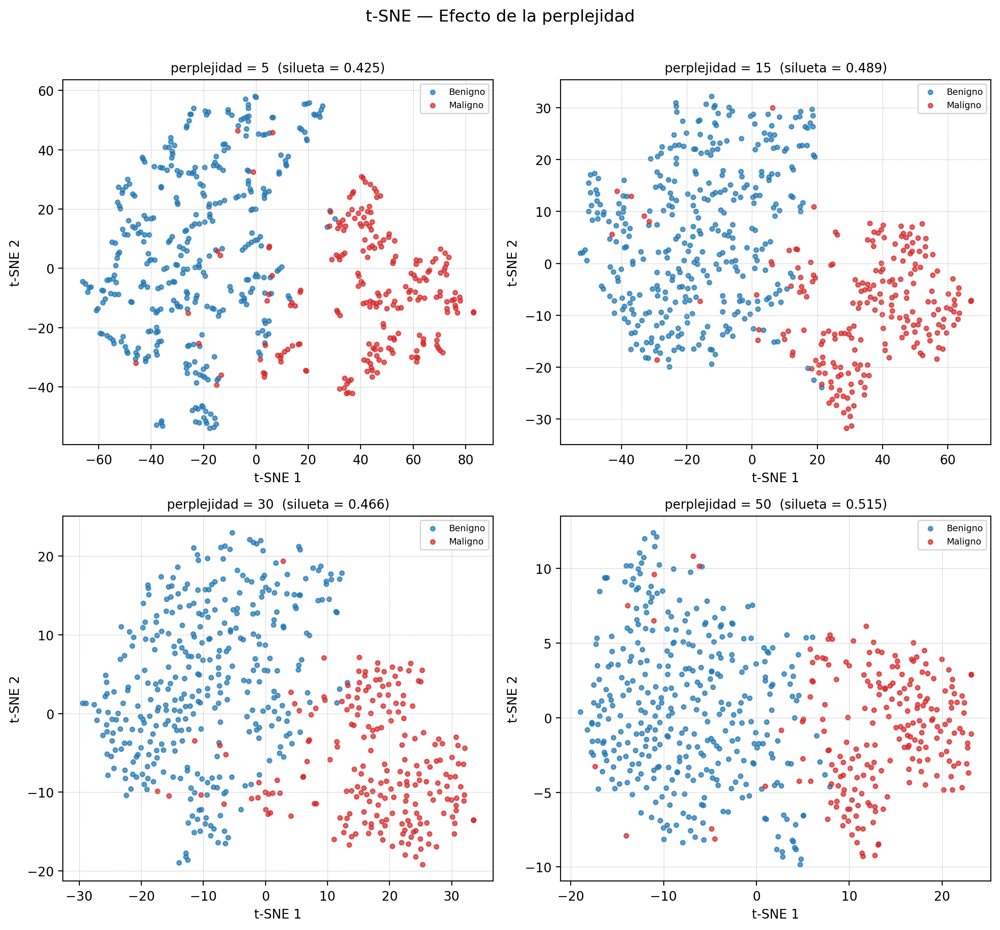

# t-SNE (Incrustación Estocástica de Vecinos con Distribución t)

## 1. Descripción teórica

### Explicación del algoritmo y objetivo principal

t-SNE es una técnica de reducción de dimensionalidad no lineal diseñada específicamente para la visualización de datos de alta dimensión en 2D o 3D. El algoritmo funciona en dos etapas: primero, construye una distribución de probabilidad conjunta sobre pares de puntos en el espacio original, de modo que puntos similares tengan alta probabilidad de ser seleccionados como vecinos; segundo, define una distribución t de Student similar en el espacio de baja dimensión y minimiza la divergencia de Kullback-Leibler (KL) entre ambas distribuciones mediante descenso de gradiente.

### Principales características y supuestos

- Preserva la **estructura local**: puntos cercanos en alta dimensión permanecen cercanos en la proyección.
- Utiliza una distribución t de Student (colas pesadas) en el espacio de baja dimensión para aliviar el problema del "crowding" (aglomeración).
- El parámetro **perplexity** controla el balance entre estructura local y global: valores bajos enfatizan vecindarios pequeños, valores altos consideran más contexto.
- Es **no paramétrico**: no asume distribución ni linealidad en los datos.
- Es **estocástico**: distintas ejecuciones pueden dar resultados ligeramente diferentes.
- Las distancias absolutas en la proyección no tienen significado cuantitativo; solo la estructura relativa (vecindades) es interpretable.

### Diferencias con PCA y otros métodos

| Aspecto | t-SNE | PCA |
|---|---|---|
| Tipo de transformación | No lineal | Lineal |
| Preserva | Estructura local (vecindarios) | Varianza global |
| Escalabilidad | O(n²) — costoso para datasets grandes | O(np min(n,p)) — eficiente |
| Determinismo | Estocástico | Determinístico |
| Inversibilidad | No invertible | Invertible |
| Uso principal | Visualización 2D/3D | Reducción de dimensionalidad general |

## 2. Usos y aplicaciones

### Principales usos en análisis de datos

- **Visualización exploratoria**: proyectar datos multidimensionales a 2D para identificar agrupamientos, valores atípicos y patrones que no son evidentes en el espacio original.
- **Validación de agrupamientos**: verificar visualmente si los grupos encontrados por algoritmos de agrupamiento son coherentes.
- **Análisis de representaciones vectoriales**: visualizar representaciones aprendidas por redes neuronales (word2vec, BERT, etc.).

### Áreas de aplicación

1. **Bioinformática y genómica**: visualización de datos de RNA-seq de célula única para identificar tipos celulares. t-SNE es estándar en herramientas como Seurat y Scanpy para revelar subpoblaciones celulares en miles de dimensiones génicas.
2. **Diagnóstico médico por imágenes**: proyección de características extraídas de imágenes médicas (mamografías, histopatología) para visualizar la separación entre clases benignas y malignas, como en este ejercicio.
3. **Seguridad informática**: visualización de tráfico de red multidimensional para detectar patrones anómalos de intrusión o malware.

## 3. Aplicación práctica

### Dataset utilizado

- **Fuente**: Breast Cancer Wisconsin (Diagnostic), UCI / Kaggle
- **Muestras**: 569 (tumores de mama)
- **Características**: 30 variables numéricas (radio, textura, perímetro, área, suavidad, compacidad, concavidad, puntos cóncavos, simetría, dimensión fractal — cada una con media, error estándar y peor valor)
- **Etiquetas**: Maligno (M) / Benigno (B)

### Decisiones de preprocesamiento

- Se eliminaron las columnas `id` y `diagnosis` (esta última se conservó como etiqueta para colorear).
- Se aplicó `StandardScaler` (media=0, desviación=1) a todas las características, necesario porque t-SNE es sensible a la escala de las variables.

### Parámetros explorados

| Parámetro | Valores |
|---|---|
| Perplejidad (perplexity) | [5, 15, 30, 50] |
| Iteraciones | 1000 |
| Inicialización | PCA |
| Tasa de aprendizaje | auto |

### Resultados obtenidos

**Tabla 1.** Métricas de t-SNE para cada valor de perplejidad explorado.

| Perplejidad | Silueta | Divergencia KL | Tiempo (s) |
|---|---|---|---|
| 5 | 0.425 | 1.0961 | 4.3 |
| 15 | 0.489 | 1.0836 | 3.5 |
| 30 | 0.466 | 0.9532 | 4.2 |
| 50 | 0.515 | 0.8046 | 4.8 |

**Mejor configuración**: perplejidad=50 con silueta=0.515

**Figura 1.** Proyecciones t-SNE con cuatro valores de perplejidad. Colores: rojo = maligno, azul = benigno. Perplejidades bajas producen agrupamientos más fragmentados; valores altos generan separaciones más suaves y globales.

**Figura 2.** Mejor proyección t-SNE (perplejidad=50, silueta=0.515). Se observa una separación clara entre tumores malignos (rojo) y benignos (azul), con mínima superposición entre clases.

### Interpretación

La proyección t-SNE logra una separación visual clara entre tumores malignos y benignos (Figura 2). La Tabla 1 muestra que la mejor perplejidad (50) produce agrupamientos compactos y bien separados (silueta=0.515). Como se observa en la Figura 1, perplejidades bajas (5) tienden a fragmentar los agrupamientos en sub-grupos pequeños, mientras que valores altos producen proyecciones más globales pero menos definidas localmente. La divergencia KL baja (0.8046) indica que la distribución en 2D reproduce fielmente las relaciones de vecindad del espacio original. Es importante recordar que las distancias entre grupos en t-SNE no son directamente comparables; solo la cohesión interna de cada grupo es interpretable.

### Limitaciones

- **No preserva distancias globales**: las distancias entre grupos separados en la proyección no son interpretables; solo la estructura intra-grupo es confiable.
- **Sensibilidad a la perplejidad**: distintos valores producen visualizaciones muy diferentes (ver Figura 1), lo que puede llevar a interpretaciones erróneas si no se exploran múltiples configuraciones.
- **No determinístico**: cada ejecución sin semilla fija puede producir proyecciones diferentes.
- **Escalabilidad limitada**: la complejidad O(n²) lo hace impracticable para datasets con más de ~10,000 observaciones sin técnicas de aproximación.
- **No permite proyectar datos nuevos**: a diferencia de PCA o UMAP, no se puede aplicar la transformación aprendida a observaciones nuevas.
