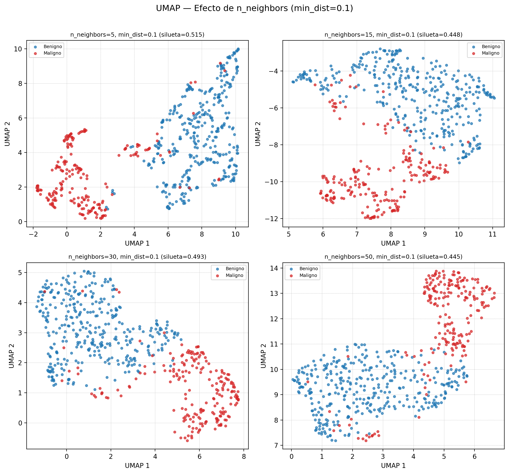
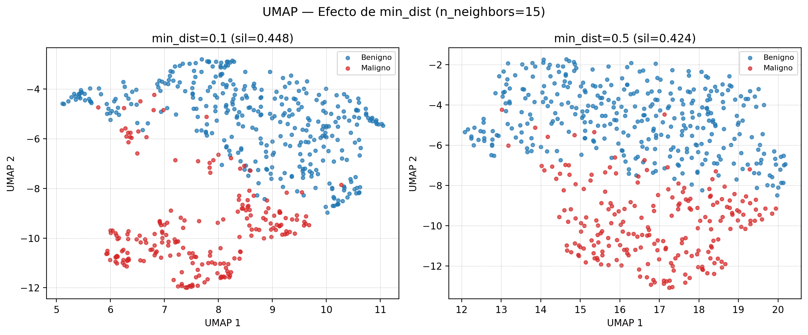
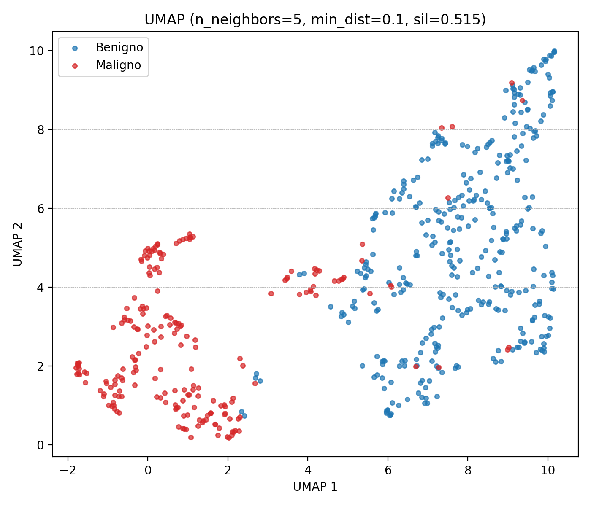
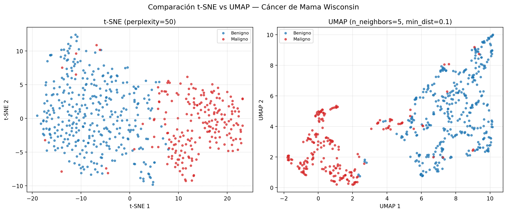

# UMAP (Aproximación y Proyección Uniforme de Variedades)

## 1. Descripción teórica

### Explicación del algoritmo y objetivo principal

UMAP es una técnica de reducción de dimensionalidad no lineal fundamentada en topología algebraica y geometría riemanniana. El algoritmo modela la estructura de alta dimensión como un grafo ponderado de vecinos (fuzzy simplicial set) y luego optimiza un layout en baja dimensión que preserve la topología de ese grafo. En concreto: (1) construye un grafo de k-vecinos más cercanos con pesos exponenciales basados en distancias locales; (2) simetriza el grafo para obtener una representación topológica fuzzy; (3) minimiza la entropía cruzada entre el grafo original y el grafo en el espacio de baja dimensión mediante descenso de gradiente estocástico.

### Principales características y supuestos

- Asume que los datos están distribuidos uniformemente sobre un manifold (variedad) localmente conexo inmerso en el espacio de alta dimensión.
- Preserva tanto la **estructura local** como la **estructura global** de los datos (mejor que t-SNE en este aspecto).
- **n_neighbors** controla el tamaño del vecindario local: valores pequeños enfatizan detalles locales, valores grandes capturan más estructura global.
- **min_dist** controla qué tan compactos son los clusters en la proyección: valores pequeños permiten puntos más apretados, valores grandes los dispersan.
- Es significativamente más **rápido** que t-SNE para datasets grandes (complejidad aproximada O(n^1.14)).
- A diferencia de t-SNE, UMAP puede generar transformaciones para datos nuevos (método `.transform()`).

### Diferencias con PCA y t-SNE

| Aspecto | UMAP | PCA | t-SNE |
|---|---|---|---|
| Transformación | No lineal | Lineal | No lineal |
| Estructura preservada | Local + global | Global (varianza) | Principalmente local |
| Escalabilidad | Buena (O(n^1.14)) | Excelente | Limitada (O(n²)) |
| Datos nuevos | Soporta `.transform()` | Soporta | No soporta |
| Fundamento teórico | Topología algebraica | Álgebra lineal | Teoría de la información |
| Distancias entre clusters | Más interpretables | Interpretables | No interpretables |

## 2. Usos y aplicaciones

### Principales usos en análisis de datos

- **Visualización de datos de alta dimensión**: alternativa más rápida y con mejor preservación global que t-SNE.
- **Preprocesamiento para agrupamiento**: las proyecciones UMAP pueden usarse como entrada para algoritmos de agrupamiento (HDBSCAN, KMeans) mejorando la separación.
- **Exploración de representaciones vectoriales**: visualización de representaciones de redes neuronales, vectores de palabras y características aprendidas.

### Áreas de aplicación

1. **Genómica y análisis de célula única**: UMAP ha reemplazado parcialmente a t-SNE como estándar de visualización en transcriptómica de célula única gracias a su velocidad y mejor preservación de la estructura global entre tipos celulares.
2. **Detección de anomalías en ciberseguridad**: proyección de vectores de características de tráfico de red para identificar visualmente comportamientos anómalos y ataques que se separan de los patrones normales.
3. **Investigación farmacéutica**: visualización de espacios químicos de alta dimensión (descriptores moleculares) para identificar familias de compuestos y candidatos a fármacos.

## 3. Aplicación práctica

### Dataset utilizado

- **Fuente**: Breast Cancer Wisconsin (Diagnostic), UCI / Kaggle
- **Muestras**: 569
- **Características**: 30 (10 medidas × 3 estadísticos: media, error estándar, peor valor)
- **Etiquetas**: Maligno (M) / Benigno (B)

### Decisiones de preprocesamiento

- Mismo preprocesamiento que t-SNE: eliminación de `id` y `diagnosis`, seguido de `StandardScaler`.
- Esto permite una comparación justa entre ambos métodos.

### Parámetros explorados

| Parámetro | Valores |
|---|---|
| n_neighbors | [5, 15, 30, 50] |
| min_dist | [0.1, 0.5] |
| n_components | 2 |

### Resultados obtenidos

**Tabla 1.** Métricas de UMAP para cada combinación de hiperparámetros.

| n_neighbors | min_dist | Silueta | Tiempo (s) |
|---|---|---|---|
| 5 | 0.1 | 0.515 | 12.3 |
| 5 | 0.5 | 0.429 | 1.0 |
| 15 | 0.1 | 0.448 | 1.5 |
| 15 | 0.5 | 0.424 | 1.5 |
| 30 | 0.1 | 0.493 | 2.3 |
| 30 | 0.5 | 0.446 | 2.3 |
| 50 | 0.1 | 0.445 | 2.6 |
| 50 | 0.5 | 0.460 | 2.2 |

**Mejor configuración**: n_neighbors=5, min_dist=0.1 con silueta=0.515

**Figura 1.** Efecto de n_neighbors sobre la proyección UMAP (min_dist=0.1 fijo). Valores pequeños enfatizan estructura local (agrupamientos más fragmentados); valores grandes producen proyecciones más suaves con mejor separación global.

**Figura 2.** Efecto de min_dist sobre la proyección UMAP (n_neighbors=15 fijo). Con min_dist=0.1 los puntos se agrupan densamente; con min_dist=0.5 se dispersan, proporcionando mayor separación visual entre observaciones.

**Figura 3.** Mejor proyección UMAP (n_neighbors=5, min_dist=0.1, silueta=0.515). Rojo = maligno, azul = benigno.

**Figura 4.** Comparación lado a lado de las mejores proyecciones t-SNE (izquierda) y UMAP (derecha) sobre el mismo dataset. UMAP tiende a mantener mejor las distancias relativas entre los grupos maligno y benigno.

### Interpretación

UMAP produce una separación clara entre tumores malignos y benignos (Figura 3). La Tabla 1 muestra que n_neighbors tiene el mayor impacto: valores pequeños (5) generan agrupamientos más fragmentados con estructura local detallada (Figura 1), mientras que valores grandes (50) producen proyecciones más suaves que capturan la separación global. El min_dist controla la compacidad visual (Figura 2): con min_dist=0.1 los puntos se agrupan densamente, con min_dist=0.5 se dispersan más.

La Figura 4 compara las mejores configuraciones de t-SNE y UMAP. UMAP tiende a mantener mejor las distancias relativas entre grupos (no solo dentro de ellos), haciendo que la separación espacial entre los grupos M y B sea más interpretable que en t-SNE.

### Limitaciones

- **Dependencia de hiperparámetros**: los resultados varían significativamente con n_neighbors y min_dist (ver Figuras 1 y 2); no existe una combinación universalmente óptima.
- **Fundamento teórico complejo**: la justificación matemática (topología algebraica, conjuntos simpliciales difusos) es más difícil de comunicar que la de PCA o SVD.
- **Estocástico**: aunque más estable que t-SNE, los resultados pueden variar entre ejecuciones sin semilla fija.
- **Sensibilidad a la escala**: requiere normalización previa de las características.
- **No preserva varianza**: a diferencia de PCA/SVD, no existe un concepto de 'varianza explicada' que permita evaluar cuánta información se retiene en la proyección.
